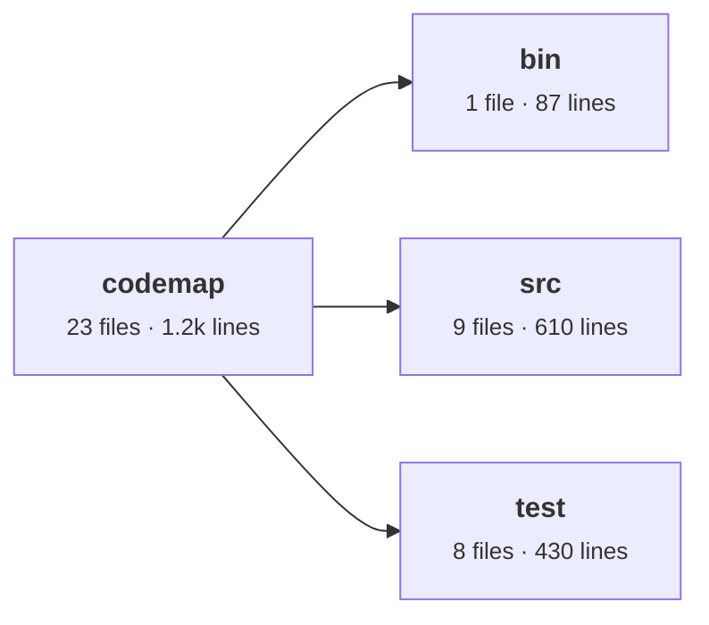

# codemap

Draws a repository's folder tree as a diagram inside its README. It lists
files with `git`, so ignored files never appear, and it works for any
language. GitHub renders the result (Mermaid) in light and dark themes. Big
repos stay readable: one overview of the top level, then a fold-out section
per folder. Each box shows file and line counts; names link to GitHub.

<!-- codemap:start -->
<!-- Generated by codemap. Edit codemap.config.json and re-run; changes here are overwritten. -->


<!-- codemap:end -->

## Usage

1. Add these two lines to your README where the map should go:

   ```markdown
   <!-- codemap:start -->
   <!-- codemap:end -->
   ```

2. Optionally add `codemap.config.json` to the repository root:

   ```json
   {
     "exclude": [".claude", "**/*.png"],
     "describe": { "lib/items": "Exercise types", "proxy.ts": "Login gating" },
     "groups": [{ "name": "English courses", "paths": ["app/(english)"] }]
   }
   ```

   `exclude` hides paths, `describe` adds a one-line note (and puts a file on
   the map), `groups` colours up to four areas. Also: `sectionDepth` (default
   2) and `links` (default `true`).

3. From the repository root, write the map:

   ```sh
   npx github:JumpLikeFLEA/codemap --write README.md
   ```

4. Re-run it after moving folders. In CI, `--check` exits 1 if the map is out
   of date.

Needs Node 20+ and no dependencies. Run `npm test` to test.
